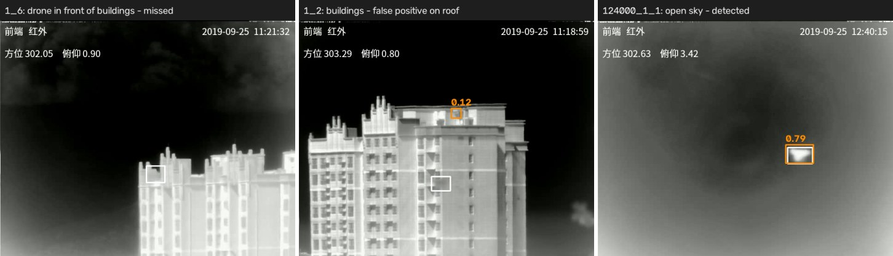

# Anti-UAV Drone Detection

A YOLO-based drone detector for the Anti-UAV dataset, trained on infrared and visible video. Designed with defense industry practice in mind: evaluation on unseen recordings, per-sensor reporting, and a joint vs per-sensor model comparison.

## Dataset

**Anti-UAV Dataset**
- Infrared (640×512) and visible (1920×1080) video, recorded simultaneously
- Ground truth bounding boxes per frame (JSON)
- Test recordings are fully separate from train/val recordings

```
datasets/
├── videos/{train,val,test}_videos/<recording>/{infrared,visible}.{mp4,json}
├── images/{train,val,test}/{infrared,visible}/
└── labels/{train,val,test}/{infrared,visible}/
```

## Problem & Approach

The first version trained on infrared at 640, then fine-tuned the same model on visible frames. Validation looked good, but the test score collapsed. Two causes:

1. **Data leakage in validation** - every recording in the original val folder also appears in train (same day, sky and drone). Val mAP measured memorization, not generalization; the test set uses different recordings.
2. **Catastrophic forgetting** - fine-tuning only on visible overwrote what the model had learned on infrared.

Fixes:
- **Recording-based split** (`scripts/make_splits.py`): whole recordings are held out for validation, so val mAP reflects unseen flights.
- **Three models compared on the same splits**: one joint model (infrared + visible together, no forgetting) and one model per sensor.
- **Per-sensor test scores**, so a weak sensor is not hidden in a combined number.

## Pipeline

```bash
# 1. Prepare data (no argument = train, val and test)
python scripts/extract_frames.py    # MP4 -> PNG frames
python scripts/convert_labels.py    # JSON -> YOLO labels
python scripts/make_splits.py       # recording-based image lists in splits/

# 2. Train (settings in configs/train.yaml)
python train.py joint
python train.py infrared
python train.py visible

# 3. Evaluate all trained models on the test set and compare
python evaluate.py
```

`extract_frames.py` and `convert_labels.py` also accept a single split, e.g. `python scripts/extract_frames.py test`. All paths are resolved from the repo root, so the scripts can be run from any directory.

## Configuration

**configs/train.yaml** - training settings. `common` is shared by every mode, `modes` holds only what differs:

| Mode | Data | imgsz |
|------|------|-------|
| joint | `configs/data.yaml` | 960 |
| infrared | `configs/data_ir.yaml` | 640 (native resolution) |
| visible | `configs/data_visible.yaml` | 960 |

Epochs and batch can be overridden from the command line: `python train.py visible 50 8`.

**imgsz**: YOLO scales each image so its long side equals imgsz, keeping the aspect ratio. At 640 a typical visible drone shrinks to ~21 px; at 960 it stays ~31 px. Evaluation always uses the imgsz saved in the model, so train and test cannot get out of sync.

## Results

Test set: 15 recordings (14,348 frames per sensor) that never appear in training or validation.

| Sensor | Joint model mAP50 | Per-sensor model mAP50 |
|--------|-------------------|------------------------|
| Infrared | 0.552 | **0.686** |
| Visible | **0.911** | 0.753 |

Full test metrics (`python evaluate.py`):

| Model | Test set | mAP50 | mAP50-95 | Precision | Recall |
|-------|----------|------:|---------:|----------:|-------:|
| joint | infrared + visible | 0.730 | 0.408 | 0.907 | 0.643 |
| joint | infrared | 0.552 | 0.304 | 0.849 | 0.485 |
| joint | visible | 0.911 | 0.513 | 0.943 | 0.818 |
| infrared | infrared | 0.686 | 0.372 | 0.862 | 0.613 |
| visible | visible | 0.753 | 0.427 | 0.945 | 0.691 |

Training runs (YOLOv8m, COCO-pretrained). Epochs were capped below the config's 30 for time. Ultralytics accumulates gradients to a nominal batch of 64, so the different batch sizes have little effect:

| Model | imgsz | Batch | Epochs run (max) | Best val mAP50 |
|-------|------:|------:|-----------------:|---------------:|
| infrared | 640 | 8 | 14 (15) | 0.994 |
| visible | 960 | 2 | 20 (30) | 0.992 |
| joint | 960 | 2 | 16 (30) | 0.993 |

### Findings

- **No single winner: the best model depends on the sensor.** On visible, the joint model is clearly better (+15.8 mAP50): the extra infrared frames act as more training data. On infrared it is clearly worse (−13.4 mAP50), even though it trained for more epochs than the infrared-only model. Visible frames dominate what the joint model learns, at the cost of infrared. Note that the joint model also sees infrared at 960 (upscaled 1.5×), while the infrared model uses the native 640, which may contribute.
- **Practical choice:** the joint model for the visible camera, the infrared-only model for the thermal camera. The [tracking project](https://github.com/yavuzkrm/Anti-UAV-Drone-Tracking) uses the infrared-only model.
- **Validation ≈ 0.99, test 0.55-0.91: a generalization gap, not memorization.** Validation recordings are also unseen by the model and still score ~0.99, so the model does not just memorize training images. The gap comes from conditions that are rare in training. Infrared is hit hardest.

### Failure analysis (infrared)

Per test recording, the infrared model's recall varies widely: it finds the drone (IoU > 0.3, any score) in 96-100% of frames on every validation recording, but on test anywhere from 19% (`1_6`) to 100% (`124000_1_1`). The failing recordings share one condition: **the drone flies in front of buildings**, where it blends into a bright, cluttered background. Against open sky it is detected reliably.


*White: ground truth, orange: detections with score ≥ 0.1. Infrared model.*

Next steps this points to: more training frames with cluttered (building, tree) backgrounds, hard-negative mining on the false positives, and longer training.

*Earlier proof of concept (YOLOv8n, 5 videos, 10 epochs): mAP50 87.5%, mAP50-95 49.2%. Not comparable with the current setup.*

## Installation

```bash
pip install -r requirements.txt
```

For GPU training, install the CUDA build of PyTorch first, following [pytorch.org](https://pytorch.org/get-started/locally/).

## File Structure
```
Anti-UAV-Drone-Detection/
├── configs/
│   ├── train.yaml            # Training settings
│   ├── data.yaml             # Dataset: infrared + visible
│   ├── data_ir.yaml          # Dataset: infrared only
│   └── data_visible.yaml     # Dataset: visible only
├── scripts/
│   ├── extract_frames.py     # Video -> frames
│   ├── convert_labels.py     # JSON -> YOLO labels
│   └── make_splits.py        # Recording-based train/val/test lists
├── train.py                  # Training (joint / infrared / visible)
├── evaluate.py               # Test set evaluation and model comparison
├── requirements.txt
├── LICENSE
└── README.md
```

Generated, not tracked by git: `datasets/` (frames and labels), `splits/` (image lists), `models/` (best weights), `runs/` (Ultralytics outputs).

## Defense Applications

- Autonomous drone detection systems
- Surveillance infrastructure enhancement
- Real-time threat assessment
- Multi-spectrum analysis (IR + visible)

## Future Work

- [ ] False alarm rate and recall by drone size
- [x] Drone tracking module: [Anti-UAV-Drone-Tracking](https://github.com/yavuzkrm/Anti-UAV-Drone-Tracking) (Kalman Filter vs ByteTrack)
- [ ] Decision-level fusion of infrared and visible
- [ ] ONNX/TensorRT optimization and FPS measurement
- [ ] Multi-class detection (drone types)

## References

- Ultralytics YOLOv8: https://github.com/ultralytics/ultralytics
- YOLO: https://arxiv.org/abs/2301.04335

## Author

**Yavuz Kerem**  
Computer Engineering, Ankara University

## License

This project is licensed under the [MIT License](LICENSE).
